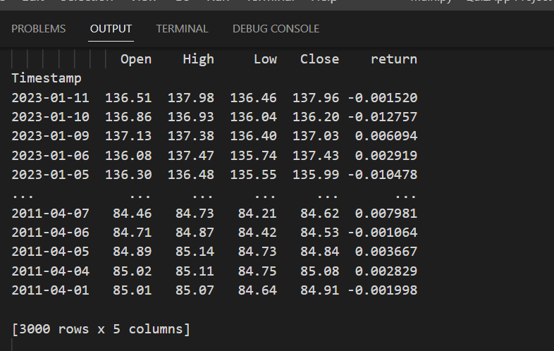

# candlestick-patterns
> Candlestick patterns detector

## Available patterns

* Bearish engulfing
* Bullish engulfing
* BullishRisingThree
* BearishfallingThree

### Dataframe requirements

- Dataframe must contain open, high, low and close prices
- Open, high, low and close prices must be in numeric type.

